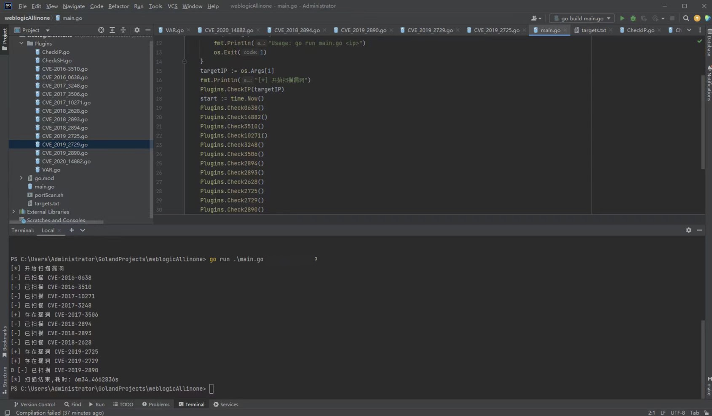

# weblogicAllinone
## 简介
可以自动探测出weblogic的端口，在实际开发中很少有用默认端口的。目前很多相关工具并没有这个功能，也是迫于个人使用需要而写的，后续会补起CVE。

## 免责声明
本工具仅能在取得足够合法授权的企业安全建设中使用，在使用本工具过程中，您应确保自己所有行为符合当地的法律法规。 如您在使用本工具的过程中存在任何非法行为，您将自行承担所有后果，本工具所有开发者和所有贡献者不承担任何法律及连带责任。 除非您已充分阅读、完全理解并接受本协议所有条款，否则，请您不要安装并使用本工具。 您的使用行为或者您以其他任何明示或者默示方式表示接受本协议的，即视为您已阅读并同意本协议的约束

## 支持漏洞
```
CVE-2016-3510
CVE_2017_3248
CVE_2018_2893
CVE_2019_2729
CVE_2016_0638
CVE_2017_3506
CVE_2018_2894
CVE_2019_2890
CVE_2017_10271
CVE_2018_2628
CVE_2019_2725
CVE_2020_14882
......
```

## 用法

window系统：

```go
main.exe <IP> //需要提前利用里面的脚本获取的端口并写入targets.txt
```

Linux 系统：

```go
main <IP> //直接运行
```

构建

```go
go build main.go
```

## 细节

- portScan.sh 脚本预设探测端口范围7000-10000 根据需要修改

## 效果图



